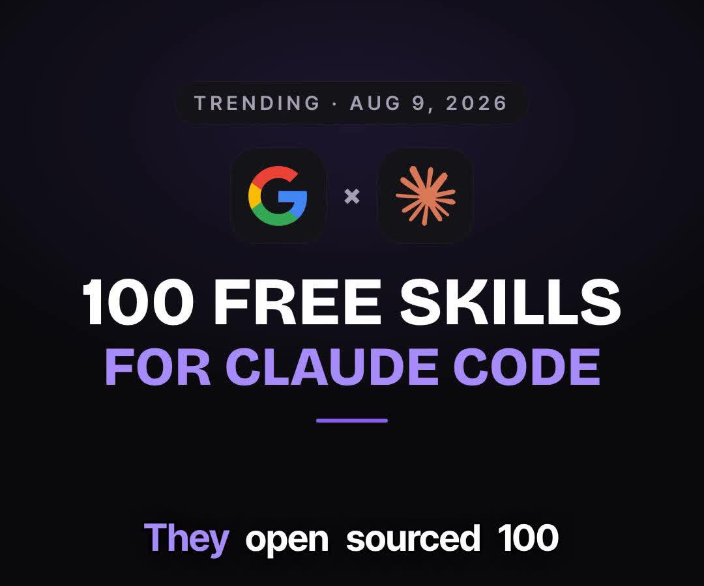

# Reels Engine

[](LICENSE)
[](https://github.com/johannships/reels-engine/actions)
[](CONTRIBUTING.md)

**An AI clone of you, posting daily.** This engine produced **931K
impressions in 90 days** for ~$34 in render credits —
[watch the full breakdown](https://www.youtube.com/watch?v=kksHFCkX-Mk) of exactly how.



Automated short-form pipeline:
trend research (GitHub / Hacker News / RSS) → LLM-written scripts in YOUR
voice → HeyGen avatar clone → Remotion graphics + karaoke captions → a QA
gate that checks every frame (face position, audio loudness, black frames,
caption accuracy) → scheduled to every platform via Metricool. Plus a
2-hourly breakout watcher for big trends and a metrics-driven style memo
that makes every script better than the last. You approve each video with
one tap in Telegram. Nothing posts itself.

Built and run daily by [Johann](https://johann.fyi) ([@johannships](https://instagram.com/johannships)) —
this is the actual engine behind the channel, not a demo. I share how I
operate it profitably (my live configs, funnel numbers, what the metrics
taught it) inside [AI Operators](https://www.skool.com/ai-operators-5011/about).

## Try it in 60 seconds (no accounts, no keys)

Only needs Node 20+. Renders a real episode's graphics so you can see what
the machine makes before you sign up for anything:

```
git clone https://github.com/johannships/reels-engine && cd reels-engine
mkdir -p episodes/demo-episode && cp examples/demo-episode/* episodes/demo-episode/
cd studio && npm install && npx remotion render RepoRadar \
  ../episodes/demo-episode/canvas.mp4 --props=../examples/demo-episode/props.preview.json
```

Everything past this point is accounts and keys (HeyGen, Metricool,
Telegram) — Python 3.11+, ffmpeg, and whisper.cpp only enter at the full
pipeline stage, and the whisper model auto-downloads on first run.

## Set it up with Claude Code (recommended)

```
git clone https://github.com/johannships/reels-engine
cd reels-engine && claude
> set this up for me
```

`CLAUDE.md` teaches the agent the entire onboarding: a niche interview
that personalizes the writing voice, creating your HeyGen clone from zero
(including how to record the training clip so your clone doesn't fidget),
wiring Metricool + Telegram, a local proof run, and deploying to Railway,
a VPS, or a Mac mini. First reel in about an hour, most of it waiting on
renders. Prefer manual? `CLAUDE.md` reads fine as a human runbook — copy
`pipeline/.env.example` → `pipeline/.env` and go stage by stage.

## What it costs to run

- HeyGen API: ~$1 per minute of rendered avatar (the only real cost)
- LLM: ~free on a flat-rate coding plan (any Anthropic-compatible endpoint)
- Metricool Advanced (posting API) · Railway ~$5-10/mo or your own box

## How it works

```
research.py / topics.py / watch.py     what's trending in YOUR niche
        │
scriptgen.py + script-skill.md         hooks, beats, payoff discipline —
        │                              craft bible + ruthless-editor LLM
        │                              pass, tuned by your own metrics
heygen.py                              your clone, one continuous take
        │                              (looks rotate via avatarLooks)
prep.py                                whisper word timestamps → Remotion
        │                              graphics (repo cards, screenshots,
        │                              kinetic text) → ffmpeg composite
qa.py                                  format/loudness/black/freeze/
        │                              captions/face-headroom, self-
        │                              correcting crop loop
approvals.py + telegram                YOU tap approve
        │
metricool.py                           scheduled everywhere at once
```

```
pipeline/   the python pipeline · config.json (neutral defaults) ·
            config.local.json (YOUR identity — gitignored, see configlib.py)
            style-memo.md (the system's memory) · .env (secrets, untracked)
studio/     Remotion template (1080x1920, split/fullscreen layouts)
deploy/     Railway · VPS · Mac mini paths
examples/   a committed sample episode you can render without credentials
episodes/   (untracked) one folder per reel: research → script → final.mp4
```

Your identity never lives in the repo: `config.local.json` holds your
name, voice rules, niche keywords, avatar looks, and funnel words,
deep-merged over neutral defaults.

Hard-won architecture notes:
- Avatar video is composited by **ffmpeg**, never played inside Remotion
  (headless Chrome crashes; see prep.py).
- Fonts are CSS @font-face data URIs (FontFace API + delayRender hangs on
  Remotion's page recycling).
- Caption/scene alignment matches each scene's first two words against the
  Whisper transcript (list videos keep First/Second/Third openers). Scene
  openings must stay distinct — and transition slop ("Now the setup") is
  banned outright in `pipeline/script-skill.md` §3a.
- Whisper mishearings self-correct against the script's own vocabulary,
  so your CTA keyword always renders exactly (see `fix_misheard` in prep.py).

## Docs

**Operating manual:** `CLAUDE.md` (setup) · `PIPELINE.md` (daily ops) ·
`OPERATOR-HUMAN.md` (your 10-min/day job) · `OPERATOR.md` (24/7 agent
guardrails) · `CLONING.md` (instances for teammates/clients) ·
`FUNNEL.md` (comment keyword → DM → email → community monetization)

**Author's context notes** (how this system came to be — interesting, not
required for setup): `GOLDIE-NOTES.md` · `HERMES.md` · `CYNDRA-AGENT.md`

## License

MIT. Contributions: see `CONTRIBUTING.md` — this is my live daily driver,
so I merge conservatively.

If this replaces an editor for you, **star the repo** — it's how other
builders find it.
