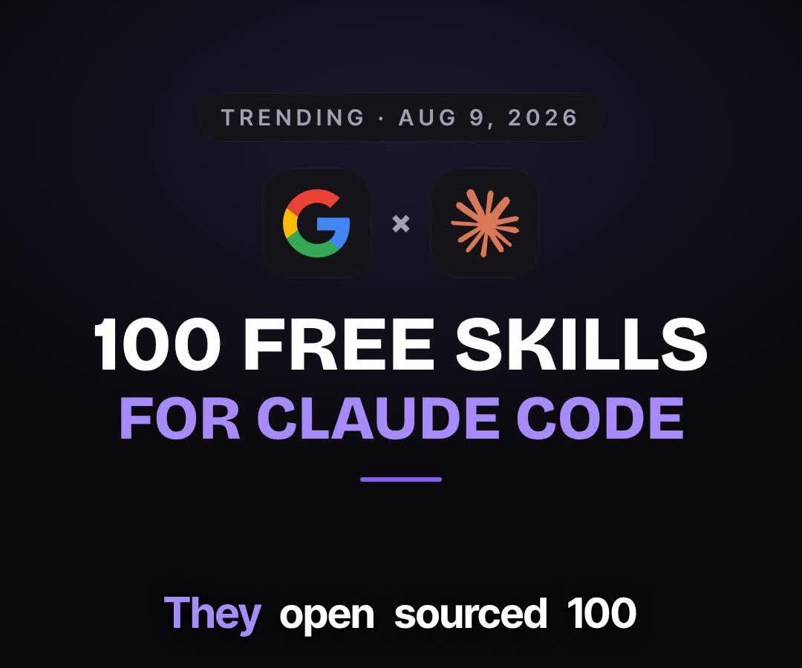

# Reels Engine

[](LICENSE)
[](https://github.com/johannships/reels-engine/actions)
[](CONTRIBUTING.md)

**Turn a raw take into a reel that looks like an editor made it.** You
record yourself on a phone or a DJI Pocket; an agent does the edit in code:
layouts that switch per line, real screens and official logos instead of
stock or generated graphics, captions on every word, and hard QA gates
before anything ships.



## The current approach

This is how the reels on the channel are made today:

- **Raw founder footage.** A real take from a phone or a DJI Pocket 3, not
  an AI clone. The edit keeps the last take of each line, trims dead air at
  -50 dB, and never time-stretches the voice.
- **Real assets only.** Live GitHub pages and README screenshots captured
  headless with a frozen page clock, and official brand logos (from the
  brand's own press page or site SVG) in the first 2 seconds. No stock, no
  AI-generated UI, no motion-graphics sizzle.
- **Dynamic layouts.** Full face, full-screen graphic, and split (graphic
  on top, face card below), switching every 2-5 seconds on the spoken word.
- **Captions on every word**, from the first frame, timed by Whisper on the
  final render. No floating pills, badges or stickers.
- **Voice + synthesised SFX**, no music bed, mastered to -14 LUFS / -1.5 dBTP.
- **QA gates that fail the build:** caption sync per chapter on the final
  render, audio length == video length, loudness, black frames, colour and
  bitrate (BT.709 limited range, >= 8 Mbps), skin luma against the source,
  a contact sheet you must look at (safe zones and the 4:5 feed crop), and a
  claims check: every on-screen number verified live and sourced.

The rules live in [`skills/edit-style/SKILL.md`](skills/edit-style/SKILL.md)
with small helper tools in [`skills/edit-style/tools/`](skills/edit-style/tools/).
[`skills/house-reel-edit`](skills/house-reel-edit/) is the same style as a
one-command engine driven by a JSON beat sheet.

## How to use it

1. **Install the skill** into Claude Code:
   ```
   git clone https://github.com/johannships/reels-engine
   cp -r reels-engine/skills/edit-style ~/.claude/skills/
   ```
   You need ffmpeg, whisper.cpp (or mlx-whisper on Apple Silicon), Node 20+
   for Remotion and headless Playwright, and Python 3 with Pillow.
2. **Drop a raw take** into its own folder, e.g. `reels/my-reel/raw.mov`
   (the original file, not a messenger-compressed copy).
3. **Say "edit this reel"** in Claude Code from that folder, with a line on
   what it's about. The agent writes a shot plan, captures the real screens
   and logos, renders, runs the gates, and hands back `final.mp4`,
   `contact.png`, `captions.srt` and a `QA.md` listing anything it cut or
   could not verify.

Look at the contact sheet and the QA notes before you post. The gates catch
a lot; they do not replace your eyes.

Built and run by [Johann](https://johann.fyi) ([@johannships](https://instagram.com/johannships)).
I share how I operate it inside [AI Operators](https://www.skool.com/ai-operators-5011/about).

---

# Legacy: the automated clone pipeline

The rest of this repo is the original fully-automated engine: an AI avatar
clone of you, posting daily. The code is still here, but I've moved away
from clone-led reels: they passed every QA gate and still weren't engaging,
and code-generated motion graphics read as AI. Raw takes edited with real
assets are the default now; treat the clone path as a fallback.

This pipeline produced **931K impressions in 90 days** for ~$34 in render
credits ([full breakdown](https://www.youtube.com/watch?v=kksHFCkX-Mk)).

Automated short-form pipeline:
trend research (GitHub / Hacker News / RSS) → LLM-written scripts in YOUR
voice → HeyGen avatar clone → Remotion graphics + karaoke captions → a QA
gate that checks every frame (face position, audio loudness, black frames,
caption accuracy) → scheduled to every platform via Metricool. Plus a
2-hourly breakout watcher for big trends and a metrics-driven style memo
that makes every script better than the last. You approve each video with
one tap in Telegram. Nothing posts itself.

## Legacy: try it in 60 seconds (no accounts, no keys)

Only needs Node 20+. Renders a real episode's graphics so you can see what
the machine makes before you sign up for anything:

```
git clone https://github.com/johannships/reels-engine && cd reels-engine
mkdir -p episodes/demo-episode && cp examples/demo-episode/* episodes/demo-episode/
cd studio && npm install && npx remotion render RepoDrop \
  ../episodes/demo-episode/canvas.mp4 --props=../examples/demo-episode/props.preview.json
```

Everything past this point is accounts and keys (HeyGen, Metricool,
Telegram) — Python 3.11+, ffmpeg, and whisper.cpp only enter at the full
pipeline stage, and the whisper model auto-downloads on first run.

## Legacy: set up the full pipeline with Claude Code

```
git clone https://github.com/johannships/reels-engine
cd reels-engine && claude
> set this up for me
```

`CLAUDE.md` teaches the agent the entire onboarding: a niche interview
that personalizes the writing voice, creating your HeyGen clone from zero
(including how to record the training clip so your clone doesn't fidget),
wiring Metricool + Telegram, a local proof run, and deploying to Railway,
a VPS, or a Mac mini. First reel in about an hour, most of it waiting on
renders. Prefer manual? `CLAUDE.md` reads fine as a human runbook — copy
`pipeline/.env.example` → `pipeline/.env` and go stage by stage.

## Legacy: what it costs to run

- HeyGen API: ~$1 per minute of rendered avatar (the only real cost)
- LLM: ~free on a flat-rate coding plan (any Anthropic-compatible endpoint)
- Metricool Advanced (posting API) · Railway ~$5-10/mo or your own box

## Legacy: how the pipeline works

```
research.py / topics.py / watch.py     what's trending in YOUR niche
        │
scriptgen.py + script-skill.md         hooks, beats, payoff discipline —
        │                              craft bible + ruthless-editor LLM
        │                              pass, tuned by your own metrics
heygen.py                              your clone, one continuous take
        │                              (looks rotate via avatarLooks)
prep.py                                whisper word timestamps → Remotion
        │                              graphics (repo cards, screenshots,
        │                              kinetic text) → ffmpeg composite
qa.py                                  format/loudness/black/freeze/
        │                              captions/face-headroom, self-
        │                              correcting crop loop
approvals.py + telegram                YOU tap approve
        │
metricool.py                           scheduled everywhere at once
```

```
pipeline/   the python pipeline · config.json (neutral defaults) ·
            config.local.json (YOUR identity — gitignored, see configlib.py)
            style-memo.md (the system's memory) · .env (secrets, untracked)
studio/     Remotion template (1080x1920, split/fullscreen layouts)
deploy/     Railway · VPS · Mac mini paths
examples/   a committed sample episode you can render without credentials
episodes/   (untracked) one folder per reel: research → script → final.mp4
```

Your identity never lives in the repo: `config.local.json` holds your
name, voice rules, niche keywords, avatar looks, and funnel words,
deep-merged over neutral defaults.

Hard-won architecture notes:
- Avatar video is composited by **ffmpeg**, never played inside Remotion
  (headless Chrome crashes; see prep.py).
- Fonts are CSS @font-face data URIs (FontFace API + delayRender hangs on
  Remotion's page recycling).
- Caption/scene alignment matches each scene's first two words against the
  Whisper transcript (list videos keep First/Second/Third openers). Scene
  openings must stay distinct — and transition slop ("Now the setup") is
  banned outright in `pipeline/script-skill.md` §3a.
- Whisper mishearings self-correct against the script's own vocabulary,
  so your CTA keyword always renders exactly (see `fix_misheard` in prep.py).

## Docs

**Operating manual:** `CLAUDE.md` (setup) · `PIPELINE.md` (daily ops) ·
`OPERATOR-HUMAN.md` (your 10-min/day job) · `OPERATOR.md` (24/7 agent
guardrails) · `CLONING.md` (instances for teammates/clients) ·
`FUNNEL.md` (comment keyword → DM → email → community monetization)

**Author's context notes** (how this system came to be — interesting, not
required for setup): `GOLDIE-NOTES.md` · `HERMES.md` · `CYNDRA-AGENT.md`

## License

MIT. Contributions: see `CONTRIBUTING.md` — this is my live daily driver,
so I merge conservatively.

If this saves you an edit, **star the repo** — it's how other
builders find it.
